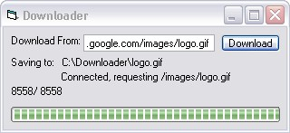



## HTTP File Downloader

### Description

Here i am bored once again, so here is my HTTP file downloader. type in a path and it will connect to the site and download the specified file. Currently doesnt support resuming...but it may soon.
 
### More Info
 

             |
---                |---
**Submitted On**   |2002-12-27 21:26:42
**By**             |[Nullific](https://github.com/Planet-Source-Code/PSCIndex/blob/master/ByAuthor/nullific.md)
**Level**          |Intermediate
**User Rating**    |4.8 (19 globes from 4 users)
**Compatibility**  |VB 6\.0
**Category**       |[Internet/ HTML](https://github.com/Planet-Source-Code/PSCIndex/blob/master/ByCategory/internet-html__1-34.md)
**World**          |[Visual Basic](https://github.com/Planet-Source-Code/PSCIndex/blob/master/ByWorld/visual-basic.md)
**Archive File**   |[HTTP\_File\_15194712272002\.zip](https://github.com/Planet-Source-Code/nullific-http-file-downloader__1-41935/archive/master.zip)

